## The Image Processing Subsytem

<div class="flex flex-col h-full">

<div class="bot_">

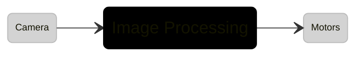
</div>
</div>


<style>
.bot_ {
  @apply pt-10;
}
</style>


---
transition: slide-left
level: 1
hideInToc: true
---

# Agenda

<Toc text-xs minDepth="1" maxDepth="3"  />


---
transition: slide-left
level: 1
---
# Initial Thoughts & Concerns for the System


---
transition: slide-left
level: 2
hideInToc: true
---
### Model vs Dataset-Focused Approaches


---
transition: slide-left
level: 2
hideInToc: true
---
### Embedded Deployment as a Key Concern

|Model   | Parameters|
| ----| --- |
| <kbd>YOLOv11 Nano</kbd>  | <span v-mark.red="1">2.6M</span>|
| <kbd>YOLOv11 Small</kbd> | 9.4M |
| <kbd>YOLOv11 Medium</kbd>| 20.1M|
| <kbd>YOLOv11 Large</kbd> | 25.3M|
| <kbd>YOLOv11 XLarge</kbd>| 56.9 |

<style>
.selected_model {
  background-color:green;
}
</style>


---
transition: slide-left
level: 1
---
# Dataset Preperation, Training Process


---
transition: slide-left
level: 2
---
### Sampled Datasets

<p style="font-size:12px">Summary for used datasets.</p>
<div style="font-size: 0.5em;   line-height: 0.01;">

| <span class="_small_text"> DATASET NAME </span>| <span class="_small_text"> SIZE WITHOUT AUGMENTATION </span>| <span class="_small_text"> OBJECT OF INTEREST </span> | <span class="_small_text"> IMAGE SIZE </span> | <span class="_small_text"> TOTAL SIZE OF THE SET </span> | <span class="_small_text"> SAMPLING </span> | <span class="_small_text"> RESOLUTION </span> |
|-------------|---------------------------|--------------------|------------------------------------|--------------------------|----------------------|-----------------------|
| Anti UAV | 10,000 | Drone | Middle | ~100,000 | Uniform Sampling from Videos | 1600 × 1600  |
| Segmented Dataset Based ... | 194 | Drone | Large | ~20,000 | Uniform Sampling from Videos | 1600 × 1600  |
| TIB-Net: Drone Detection  | 578 | Drone | Small | ~5,000 | Filter from labels (at least 40×40) | 1600 × 1600  |
| Det-Fly | 3,929 | Drone | Small | ~10,000 | Downscale with clustering | 1600 × 1600  |
| UAV-Eagle | 510 | Drone | Middle | 510 | Direct Upload | 1600 × 1600  |
| UAV-CDT | 2,823 | Drone | Middle | ~6,000 | Uniform Sampling | 1600 × 1600  |
| DUT Anti-UAV Detection | 5,182 | Drone | Small & Middle | ~5,200 | Direct Upload | 1600 × 1600  |
| VISIODECT | 4,646 | Drone | Small & Middle | ~12,000 | Uniform Sampling | 1600 × 1600  |
| UAVFly | 3,999 | Drone | Middle | ~22,000 | Uniform Sampling | 1600 × 1600  |
| MAV-Dataset | 4,990 | Drone | Middle | ~30,000 | Uniform Sampling | 1600 × 1600  |
| <span v-mark.red="1">Wosdetc</span> | 7,000 | Drone | Small | ~50.000 | Uniform Sampling | 1920 × 1080 |
| <span v-mark.red="1">LRDDv1</span> | 2,500 | Drone | Small & Middle | ~17,000 | Uniform Sampling | 1920 × 1080 |
| <span v-mark.yellow="2">Synthetic Dataset </span>| 2,000 | Drone | Middle & Large | ~Inf | N/A | 1600 × 1600  |
| <span v-mark.yellow="2">Recorded Videos </span>| 1,800 | Drone | Small & Middle | ~Inf | N/A | 1920 × 1080 |
| <span v-mark.yellow="2">Background Images </span>| 4,000 | N/A | N/A | ~Inf | N/A | 1920 × 1080 |

</div >

<style>
._small_text {
  font-weight: 300;              /* semibold, not heavy */
  background-color: white; /* very subtle contrast */
  padding-left:2px;
  padding-right:2px;
  color:black;
}
</style>


---
transition: slide-left
level: 2
---
### `Issue #1`: Train-Valid Split, Data Leakage & Domain Shift Concerns

<div style="padding:20px">
  <div>
    <span class="font-semibold;">Attempts :</span>
  </div>
  <div style="padding-left:14px; padding-top:10px; font-size:12px">
    <span>1) Totally Random Split</span>
  </div>

  <div style="padding-left:14px; font-size:12px">
    <span>2) Two of the dataset as valid</span>
  </div>

  <div style="padding-left:14px; font-size:12px">
    <span>3) Bounding Box's Width-Height Based</span>
  </div>
</div>


---
transition: slide-left
level: 2
hideInToc: true
---
### `Issue #1`: Train-Valid Split, Data Leakage & Domain Shift Concerns

<div class="w-full h-full flex justify-center items-center">
  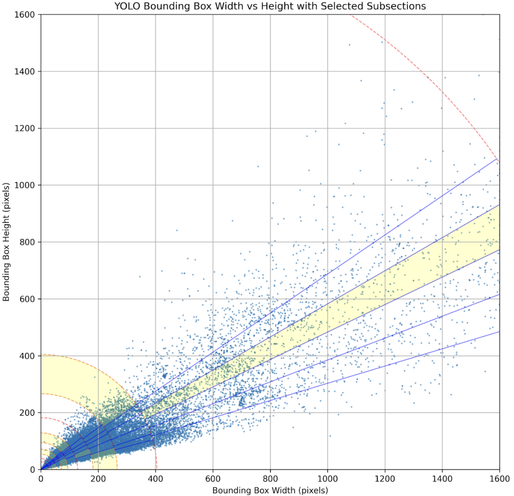
</div>


---
transition: slide-left
level: 2
---
### On-The-Fly Changes to the Dataset & Graphs


<div class="relative">
  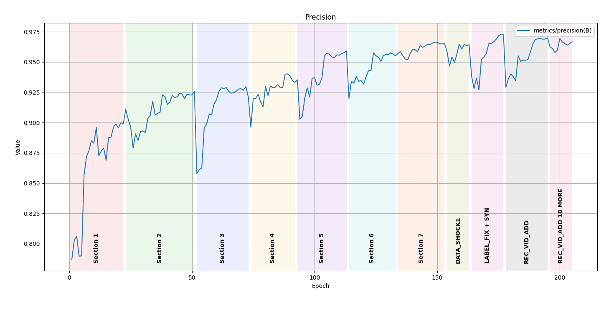

  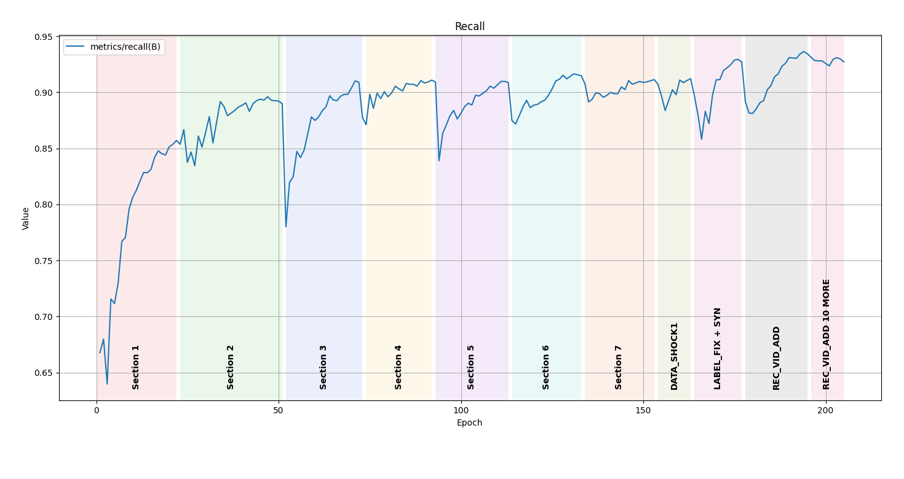
  
  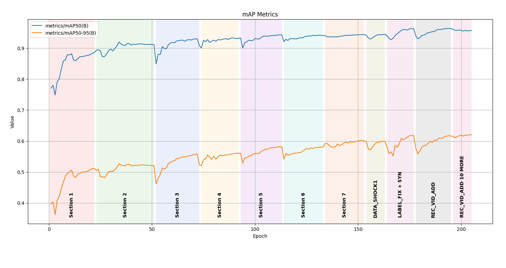
</div>


---
transition: slide-left
level: 2
layout: two-cols
---
### Hyperparameter Changes, Controls

<p style="font-size:12px">Control over <span style="font-weight:800; color:yellow;">Momentum, Learning Rate, Freeze, Augmentations, Optimizer</span></p>


````md magic-move {lines: true}

```py {7,9}
# Slow start with : learning rate
model.train(
    data=f"{WORK_DIR}/data.yaml",
    imgsz=1600,
    epochs=10,
    batch=16,
    lr0=0.003,
    patience=100,
    warmup_bias_lr= 0.003,
    name="best_after_label_fix_v2",
    save_period=2,
    device='0,1',
    resume=False,
    cos_lr=True,
    warmup_momentum=0.937,
    momentum=0.937,
    optimizer="AdamW",
)
```

```py {18}
# Freezing some backbone layers, 
 model.train(
    data=f"{WORK_DIR}/data.yaml",
    imgsz=1600,
    epochs=10,
    batch=16,
    lr0=0.003,
    patience=100,
    warmup_bias_lr= 0.003,
    name="best_after_label_fix_v2",
    save_period=2,
    device='0,1',
    resume=False,
    cos_lr=True,
    warmup_momentum=0.937,
    momentum=0.937,
    optimizer="AdamW",
    freeze=4,
)
```

```py {18}
# Freezing more backbone layers, 
 model.train(
    data=f"{WORK_DIR}/data.yaml",
    imgsz=1600,
    epochs=10,
    batch=16,
    lr0=0.003,
    patience=100,
    warmup_bias_lr= 0.003,
    name="best_after_label_fix_v2",
    save_period=2,
    device='0,1',
    resume=False,
    cos_lr=True,
    warmup_momentum=0.937,
    momentum=0.937,
    optimizer="AdamW",
    freeze=5,
)
```

```py {18}
# Freezing more backbone layers, 
 model.train(
    data=f"{WORK_DIR}/data.yaml",
    imgsz=1600,
    epochs=10,
    batch=16,
    lr0=0.003,
    patience=100,
    warmup_bias_lr= 0.003,
    name="best_after_label_fix_v2",
    save_period=2,
    device='0,1',
    resume=False,
    cos_lr=True,
    warmup_momentum=0.937,
    momentum=0.937,
    optimizer="AdamW",
    freeze=6,
)
```


````


---
transition: slide-left
level: 2
---
### Background Image Additions : Hard Negative Mining

---
transition: slide-left
level: 2
---
### Label Fixes
<div style="padding-top:20px; font-size:12px">Doing inference through train and valid sets. Threshold Confidence Score: 0.4</div>
<div style="padding-top:10px; font-size:12px">2500+ Problems</div>
<div style="padding-top:5px; font-size:12px; padding-left:20px"> • 1200 -> loosy bounding boxes or mislabeled </div>
<div style="padding-top:5px; font-size:12px; padding-left:20px"> • 700  -> less than 20x20 or GoPro</div>
<div style="padding-top:5px; font-size:12px; padding-left:20px"> • 600  -> model's mistakes</div>


---
transition: slide-left
level: 2
---
### Synthetic Image Additions, 3D Model Extraction, Image Rendering
<div style="padding-top:20px; font-size:12px">Extraction: An e-commerce site and Sketchfab (32 models)</div>
<div style="padding-top:5px; font-size:12px">Rendering: Blender</div>
<div grid="~ cols-4 gap-1" m="t-2">

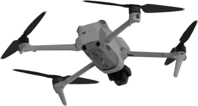
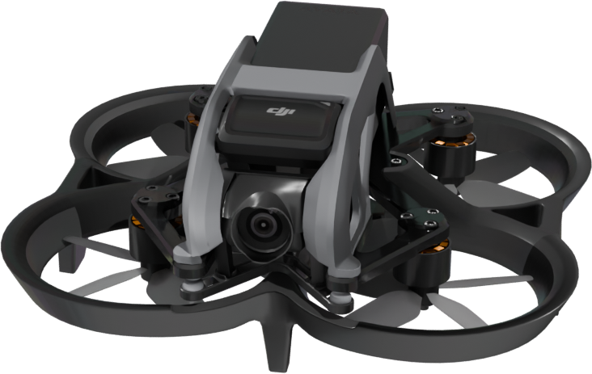
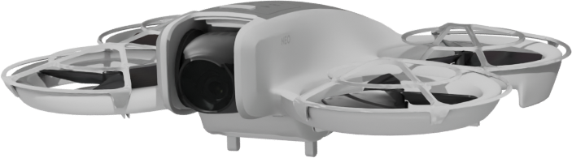
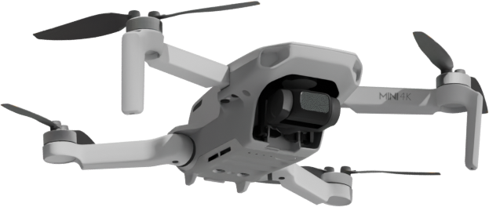

</div>

<div grid="~ cols-2 gap-1" m="t-2">
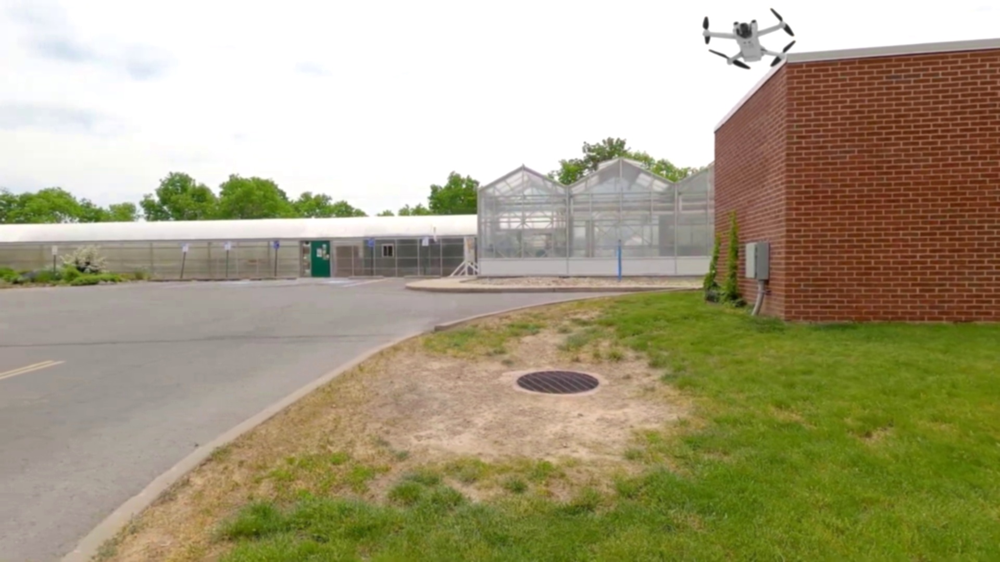
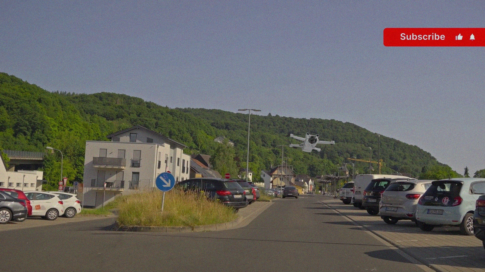
</div>


---
transition: slide-left
level: 1
---
# Generalization (?)


---
transition: slide-left
level: 1
layout: image-right
image: https://magazinmehatronika.com/wp-content/uploads/2024/08/RPiAiHailoGPIO-1.jpg
---
# Into the Accelerator

image and details of hailo

---
transition: slide-left
level: 2
---

### .pt to .hef Conversion
---
transition: slide-left
level: 2
---
### `Issue #2`: Model Architecture,  Calibration Images, Quantization


---
transition: slide-left
level: 1
---
# Plans: Solutions for Issues

---
transition: slide-left
level: 2
hideInToc: true
---
### For `Issue #1`

---
transition: slide-left
level: 2
hideInToc: true
---
### For `Issue #2`

---
transition: slide-left
level: 2
hideInToc: true
---
### Tracking


---
transition: slide-left
level: 1
---
# Last Words


---
layout: center
class: text-center text-xs
---

[fkaanoz](https://github.com/fkaanoz)
